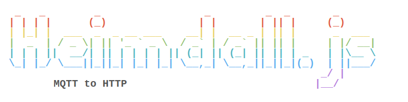

[](https://hub.docker.com/r/jschnabel/heimdall.js) 
[](https://github.com/joshua-schnabel/heimdall.js/actions?query=workflow%3Adocker)
[](https://hub.docker.com/r/jschnabel/heimdall.js) 
[](https://github.com/joshua-schnabel/heimdall.js/blob/master/LICENSE) 
[](https://github.com/joshua-schnabel/heimdall.js/issues)

 ___A lightweight MQTT to HTTP Gateway___
 
Current Version: 
[](https://hub.docker.com/r/jschnabel/heimdall.js/tags)
[](https://microbadger.com/images/jschnabel/heimdall.js) 
[](https://github.com/joshua-schnabel/heimdall.js/actions?query=branch%3Amaster+workflow%3Adocker)
[](https://github.com/joshua-schnabel/heimdall.js/commits/master)


Development Version: 
[](https://hub.docker.com/r/jschnabel/heimdall.js/tags)
[](https://microbadger.com/images/jschnabel/heimdall.js) 
[](https://github.com/joshua-schnabel/heimdall.js/actions?query=branch%3Adev+workflow%3Adocker)
[](https://github.com/joshua-schnabel/heimdall.js/commits/dev)

 * Built on the lightweight and secure Alpine Linux distribution
 * Read and write MQTT messages over HTTP
 * Last message per topic is being cached
 * Secure access to interfaces through basic-auth or API-Key

## Configuration

### Enviroment

The application can be configured both via environment variables and via a configuration file. It is recommended to configure the application via configuration file. Both the location and the name of the configuration file can be specified via environment variables.

```
CONFIGDIR #Folder where the configuration file is located, default: "./config/"
CONFIGFILE  #Name of configuration file, default: "./config/config.yml"
server.port #Port of the server, default: 3000
mqtt.adress #Adress of the mqtt server
mqtt.user #User for login into the mqtt server 
mqtt.password #Password for login into the mqtt server
users.httpuser.api-key #Api key off the user httpuser (the username is set to httpuser. If more users are needed, a configuration file must be used.)
users.httpuser.password #Password off the user httpuser
users.httpuser.rights #Rights off the user httpuser, can be MQTT_READ and/or MQTT_WRITE
```

### File

The following is an example of a configuration file.

```yml
server: #Server settings
  port: 3000 #Server Port
mqtt: #Mqtt settings
  adress: tcp://my.mqtt.com #Mqtt server adress
  user: user1 #Mqtt username 
  password: password2 #Mqtt password 
users: #User settings
  userA: #User name
    api-key: keyA #User api-key
    password: passwordA #User password
    rights: MQTT_READ,MQTT_WRITE #User right, can be MQTT_READ and/or MQTT_WRITE
```

## Usage with Docker

## Usage without Docker

If you want to use the application without a docker the following steps are necessary.

 1. Clone this repository
 1. Create a `config` folder and create a `config.yml` file in that folder
 2. Fill the configuration file as described in the previous chapter.
 2. Switch to the ´src´ folder
 3. Run `npm install`
 4. Run `npm start`

## TODO

- [ ] Docker doc
- [ ] Swagger
- [x] Prometheus
- [x] Authentication
